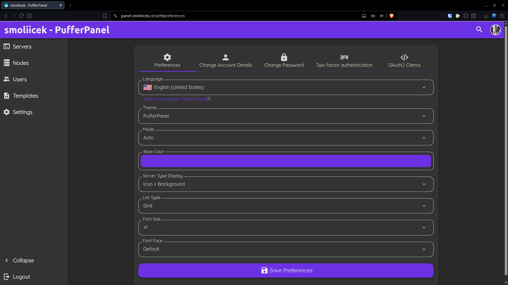
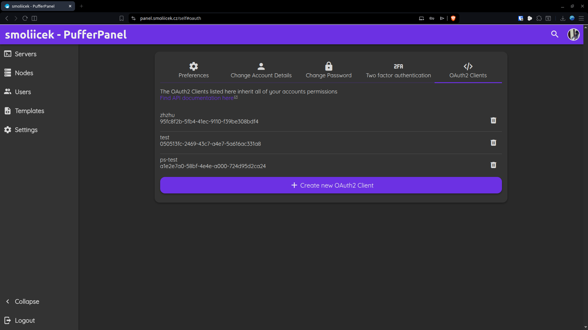
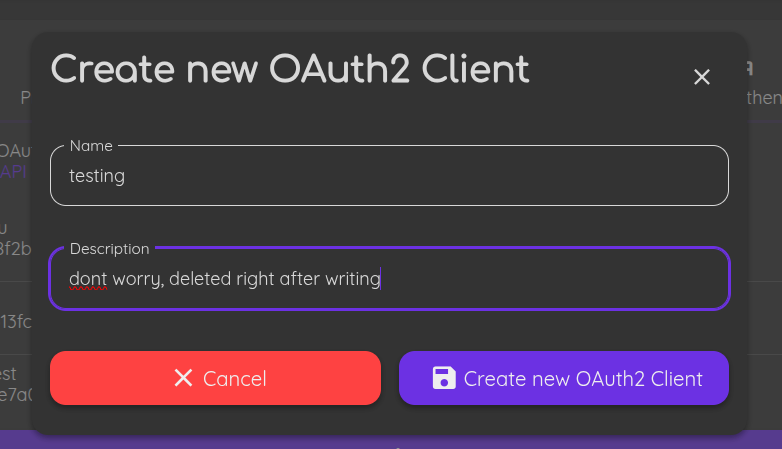
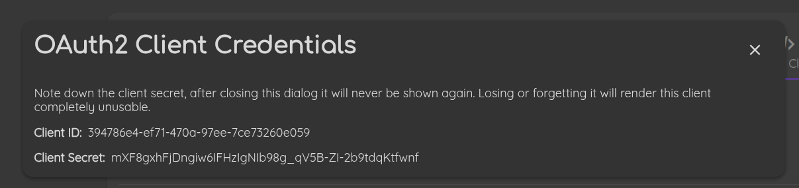

# Getting your OAuth2 Credentials
First log into your PufferPanel, using your email and password and click on your profile picture in the top right.

Down in the "OAuth2 Clients" section and click on "Create new OAuth2 client"

Fill out a name and description

Then click Create.

A window like this will pop up, write down your Client ID and Client Secret, then press the X in the right hand corner.

Continue to [Enviroment variables](../Configuration/env.md) for more information about configuring PufferStarter.
